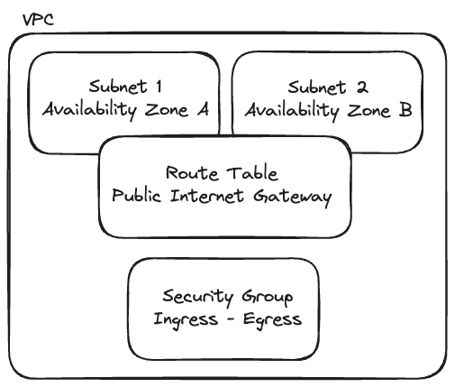

# FC-Terraform

This project implements an AWS infrastructure using Terraform, creating a secure and scalable VPC (Virtual Private Cloud) environment.

## Architecture



## Features

- VPC with DNS support and hostnames enabled
- Multiple public subnets across different availability zones
- Internet Gateway for public internet access
- Route tables for network traffic management
- Security groups with configurable ingress/egress rules
- Modular design for better code organization and reusability

## Prerequisites

- Terraform >= 0.13.1
- AWS CLI configured with appropriate credentials
- AWS account with necessary permissions

## Configuration

The project uses variables that can be customized:

- `environment` - Environment name (default: "fullcycle")
- `aws_region` - AWS region for deployment (default: "us-east-1")
- `vpc_cidr` - VPC CIDR block (default: "10.0.0.0/16")
- `public_subnet_cidrs` - CIDR blocks for public subnets (default: ["10.0.1.0/24", "10.0.2.0/24"])
- `availability_zones` - AWS availability zones (default: ["us-east-1a", "us-east-1b"])

## Getting Started

1. Clone the repository:

```bash
git clone https://github.com/gabrielmendes98/fc-terraform.git
cd fc-terraform
```

2. Initialize Terraform:

```bash
terraform init
```

3. Review the planned changes:

```bash
terraform plan
```

4. Apply the infrastructure:

```bash
terraform apply
```

5. To destroy the infrastructure:

```bash
terraform destroy
```

## Project Structure

```
.
├── main.tf # Main Terraform configuration
├── variables.tf # Project-level variables
├── modules/
│ ├── vpc/ # VPC module
│ │ ├── main.tf # VPC resource definitions
│ │ ├── variables.tf # Module variables
│ │ └── outputs.tf # Module outputs
```

## Security Considerations

- The security group configuration allows all inbound and outbound traffic by default. Modify the rules in the VPC module according to your security requirements.
- Sensitive data should be stored in `.tfvars` files and not committed to version control.
